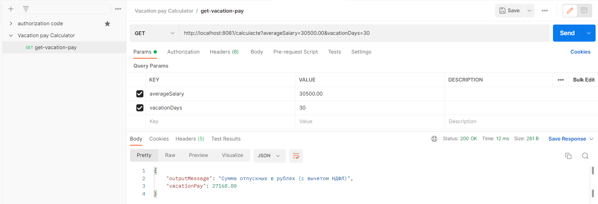
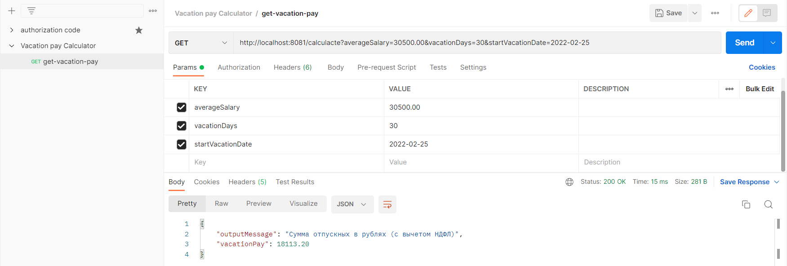

# Neoflex-test-task-java
Тестовое задание для учебного центра Neoflex, 2022  
  
Приложение "Калькулятор отпускных".  
Микросервис на SpringBoot + Java 11 c одним API:  
GET "/calculacte"  
  
Приложение принимает твою среднюю зарплату за 12 месяцев и количество дней отпуска - отвечает суммой отпускных, которые придут сотруднику.  
Доп. задание: При запросе также можно указать точные дни ухода в отпуск, тогда должен проводиться рассчет отпускных с учётом праздников и выходных.  
  
Проверяться будет чистота кода, структура проекта, название полей\классов, правильность использования паттернов. Желательно написание юнит-тестов, проверяющих расчет.  

# API requests
Простой запрос:  
http://localhost:8081/calculacte?averageSalary=30500.00&vacationDays=30  
Response: {"outputMessage":"Сумма отпускных в рублях (с вычетом НДФЛ)","vacationPay":27168.80}  
  
Запрос с указанием точного дня ухода в отпуск:  
http://localhost:8081/calculacte?averageSalary=30500.00&vacationDays=30&startVacationDate=2022-02-25  
Response: {"outputMessage":"Сумма отпускных в рублях (с вычетом НДФЛ)","vacationPay":18113.20}  

# Cтек проекта
SpringBoot  
Java 11  
Eureka Server  
Stream API  
jUnit  
MockMvc  
Docker

# Docker  
Build gradle:  
`gradlew clean build`  
Build project image with docker:  
`docker image build ./ -t nikolayshved/vacation-image`  
Running the docker container container with an images:   
`docker run -p 8081:8081 -d --name vacation-service nikolayshved/vacation-image`  
Stopping a docker container:  
`docker stop vacation-service`

# Postman
Простой запрос:  

Запрос с указанием точного дня ухода в отпуск:  

